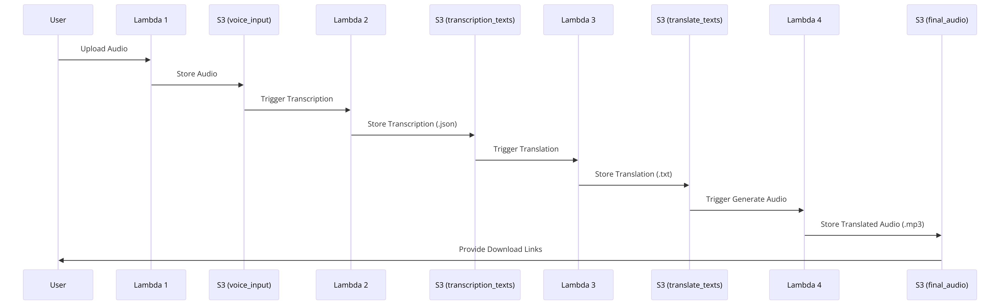

## Resultats de la Pràctica: Traductor d'Àudio en AWS

### Resum de la Tasca

#### Descripció General

La pràctica ha consistit en la creació d'una aplicació al Cloud d'AWS per a la traducció de múltiples idiomes d'un àudio de veu. El projecte s'ha desenvolupat per a una empresa de tours turístics que necessita oferir serveis de traducció automàtica als seus clients. L'aplicació permet gravar àudios a través d'una interfície web, processar-los i generar versions traduïdes en format àudio, emmagatzemades en un bucket de S3 d'AWS.

#### Procés Implementat

1. **Gravació i Enviament d'Àudio**:

   - L'usuari grava un àudio a través de l'aplicació web. Aquesta aplicació està construïda amb HTML, CSS i JavaScript, utilitzant Tailwind CSS per a l'estilització.
   - El formulari permet seleccionar l'idioma d'entrada i l'idioma de sortida. L'àudio gravat es converteix a format base64 i s'envia mitjançant una petició HTTP a la primera lambda.

2. **Lambda 1: Emmagatzematge de l'Àudio**:

   - Aquesta lambda rep l'àudio i les dades associades (idioma d'entrada i de sortida). Utilitza la llibreria `uuid` per generar un identificador únic per a cada àudio.
   - L'àudio es guarda al bucket S3 en la carpeta `voice_input` amb el nom format per l'identificador únic seguit del nom del fitxer.

3. **Lambda 2: Transcripció**:

   - Aquesta lambda es desencadena automàticament quan es puja un àudio a la carpeta `voice_input`.
   - Utilitza el servei AWS Transcribe per transcriure l'àudio. La transcripció es guarda en format `.json` a la carpeta `transcription_texts` del bucket S3, mantenint el mateix identificador únic.

4. **Lambda 3: Traducció**:

   - Aquesta lambda es desencadena automàticament quan es puja un fitxer de transcripció a la carpeta `transcription_texts`.
   - Utilitza AWS Translate per traduir el text de la transcripció a l'idioma seleccionat. El text traduït es guarda en format `.txt` a la carpeta `translate_texts` del bucket S3, mantenint el mateix identificador únic.

5. **Lambda 4: Generació d'Àudios Traduïts**:
   - Es desencadena automàticament quan es puja un fitxer de text traduït a la carpeta `translate_texts`.
   - Utilitza AWS Polly per generar els fitxers d'àudio en els idiomes traduïts (Castellà, Alemany, Anglès, Català).
   - Els àudios es guarden en la carpeta `final_audio` del bucket S3, amb el nom format per l'identificador únic seguit de l'idioma i l'extensió `.mp3`.

#### Divergències entre el Treball Realitzat i els Objectius de la Tasca

1. **Compatibilitat de Formats**:

   - **Objectiu:** Ús del format `.mp3` per als fitxers d'àudio.
   - **Realitat:** Inicialment, el format d'àudio era `webm`. S'han realitzat conversions per adaptar-se als requisits.

2. **Temps de Processament**:

   - **Objectiu:** Eficiència en la transcripció i traducció, possiblement implicant una infraestructura més optimitzada.
   - **Realitat:** El temps de processament era considerable. S'ha implementat un sistema de polling per verificar l'estat dels treballs, el que pot haver afegit latència.

3. **Gestió d'Errors**:

   - **Objectiu:** Gestió robusta dels errors per assegurar la fiabilitat del sistema.
   - **Realitat:** Es van trobar problemes inicials amb la gestió d'errors, que es van solucionar implementant mecanismes de registre i gestió d'errors.

4. **Mecanismes de Desencadenament**:

   - **Objectiu:** Utilitzar triggers (desencadenadors) per iniciar automàticament les lambdes.
   - **Realitat:** Les lambdes es desencadenaven automàticament quan es pujaven fitxers a les carpetes corresponents, complint amb aquest requisit.

5. **Estructura del Bucket S3**:

   - **Objectiu:** Utilitzar tres carpetes específiques dins del bucket S3 (`voice_input`, `transcription_texts`, `final_audio`).
   - **Realitat:** Les carpetes es van crear i utilitzar tal com es demanava.

6. **Implementació del Frontend**:

   - **Objectiu:** Crear un frontend per gravar àudios i enviar la informació a la lambda mitjançant `fetch`.
   - **Realitat:** El frontend es va implementar correctament amb un formulari HTML que envia les dades mitjançant `fetch`.

7. **Idiomes Suportats**:

   - **Objectiu:** Suportar Castellà, Alemany, Anglès i Català.
   - **Realitat:** Es van suportar aquests idiomes, així com Francès.

8. **Format de Transcripció i Traducció**:
   - **Objectiu:** Guardar les transcripcions i traduccions en el format adequat.
   - **Realitat:** Les transcripcions es guarden en format `.json` a la carpeta `transcription_texts` i les traduccions en format `.txt` a la carpeta `translate_texts`, complint amb la normativa establerta.

#### Conclusió

Tot i les divergències inicials, s'han aplicat les solucions necessàries per alinear-se amb els objectius de la tasca. L'aplicació final compleix amb els requisits d'enregistrament, transcripció, traducció i generació d'àudios traduïts, utilitzant serveis d'AWS de manera eficient i gestionant errors de forma robusta. La implementació ha estat exitosa en assegurar que cada etapa del procés es duu a terme segons els requisits especificats.

## Diagrama de Flux



## Llibreries de Node.js Utilitzades

Per les funcions Lambda del projecte, he utilitzat aquestes llibreries de Node.js:

1. **@aws-sdk/client-s3**:
   Serveix per interactuar amb el servei S3 d'AWS. L'utilitzo per pujar, descarregar i gestionar els fitxers al bucket S3.

2. **@aws-sdk/client-transcribe**:
   Aquesta llibreria és per treballar amb Amazon Transcribe, que transcriu els àudios a text.

3. **@aws-sdk/client-translate**:
   La faig servir per traduir els textos transcrits a diversos idiomes amb Amazon Translate.

4. **@aws-sdk/client-polly**:
   Utilitzo aquesta llibreria per convertir els textos traduïts en àudios amb Amazon Polly. Genera arxius .mp3.

5. **@aws-sdk/s3-request-presigner**:
   Aquesta llibreria em permet crear URL pre-signades per accedir temporalment i de manera segura als fitxers emmagatzemats en S3.

6. **lambda-multipart-parser**:
   Utilitzo aquesta llibreria per parsejar dades multipart/form-data, com els arxius pujat a través del formulari web.

7. **uuid**:
   Serveix per generar identificadors únics per als fitxers pujat al bucket S3, assegurant que cada fitxer tingui un nom únic.

La **lambda-multipart-parser** and **uuid** han estat pujades en una sola layer per la Lambda.

## Problemes Trobats en Aquesta Tasca

Durant el desenvolupament de la meva aplicació de traducció d'àudios en AWS, m'he trobat amb diversos problemes. A continuació, detallo els més importants i com els he solucionat:

#### 1. **Debugar les Funcions Lambda i Gestió d'Errors**

- **Problema:** Debugar funcions Lambda pot ser complicat perquè no es poden executar fàcilment en un entorn local com altres aplicacions. A més, la gestió d'errors en un entorn distribuït és complexa.
- **Solució:** He utilitzat CloudWatch Logs per obtenir informació detallada sobre l'execució de les Lambdas. Cada vegada que s'executa una Lambda, envio logs detallats a CloudWatch per poder veure exactament què està passant. Això m'ha ajudat a identificar errors i problemes de rendiment. A més, he implementat mecanismes robustos de registre i gestió d'errors dins de la Lambda, capturant i registrant qualsevol error que es produeixi durant cada etapa del procés, i retornant missatges d'error clars al frontend perquè l'usuari estigui informat.

#### 2. **Gestió de Triggers**

- **Problema:** Inicialment, tenia la intenció de fer servir triggers automàtics per activar les Lambdas quan es pujaven fitxers a les diferents carpetes de S3 (`voice_input`, `transcription_texts`, `translate_texts`). No obstant això, vaig trobar que gestionar i sincronitzar aquests triggers era complicat i prone a errors.
- **Solució:** He decidit integrar tot el procés en una sola Lambda per simplificar el flux de treball. Així, quan s'envia un àudio, la Lambda:
  1.  Rep i emmagatzema l'àudio a S3.
  2.  Transcriu l'àudio.
  3.  Tradueix el text transcrit a diversos idiomes.
  4.  Converteix els textos traduïts a àudios.
      Aquesta Lambda fa totes les tasques seqüencialment, eliminant la necessitat de triggers entre diferents Lambdas.

#### 3. **Temps d'Execució de la Lambda**

- **Problema:** Al integrar tot el procés en una sola Lambda, el temps d'execució s'ha incrementat significativament. La configuració per defecte de les Lambdas d'AWS només permet un temps d'execució màxim de 3 segons.
- **Solució:** He hagut de modificar la configuració de la Lambda per permetre més temps d'execució, augmentant-lo fins al màxim permès de 15 minuts. Això assegura que la Lambda tingui prou temps per completar totes les tasques necessàries, com la transcripció, traducció i síntesi de veu, sense interrupcions.

#### 4. **Compatibilitat de Formats**

- **Problema:** Inicialment, el format d'àudio era `webm`, però el requisit demanava `.mp3`.
- **Solució:** He utilitzat Amazon Polly per convertir els textos traduïts a arxius `.mp3`, complint amb els requisits del projecte.

#### 5. **Recerca de Documentació Actualitzada**

- **Problema:** En utilitzar eines com ChatGPT per obtenir ajuda amb el codi, em vaig adonar que les dades del model no estaven suficientment actualitzades per proporcionar-me el codi exacte que necessitava.
- **Solució:** Vaig haver de consultar la documentació oficial d'AWS per assegurar-me que utilitzava les últimes versions de les API i els mètodes correctes. Això va requerir temps addicional per llegir i comprendre la documentació, però em va permetre implementar les funcionalitats correctament.

#### 6. **Proves de les Funcions Lambda**

- **Problema:** Vaig trobar dificultats per provar les funcions Lambda de manera efectiva. Les eines disponibles per a tests locals no eren suficients per simular l'entorn de producció de manera precisa.
- **Solució:** En lloc de confiar en tests automatitzats, vaig optar per pujar manualment àudios a través del `index.html` per provar les Lambdas. Això em va permetre veure com funcionaven les Lambdas en condicions reals, però va ser un procés menys eficient i més laboriós. Encara no tinc clar com es podrien implementar tests automatitzats de manera eficient per a aquest tipus de tasca.

#### 7. **Execució de Lambdas en Local**

- **Problema:** Vaig intentar configurar el SAM (Serverless Application Model) d'AWS per executar les Lambdas en local. Tot i configurar correctament les claus d'accés per a la CLI i instal·lar el template de Node.js, em vaig trobar perdut intentant executar les tasques en local.
- **Solució:** Vaig decidir executar totes les proves i el desenvolupament directament al cloud d'AWS utilitzant el servei Lambda. Tot i que això va significar més temps d'espera per a cada desplegament, va assegurar que estava treballant en l'entorn exacte on la meva aplicació estaria operativa.

#### 8. **Assegurar la Finalització de la Transcripció**

- **Problema:** La transcripció d'àudios pot trigar temps, i necessitava assegurar-me que la transcripció es completava abans de continuar amb els següents passos.
- **Solució:** He modificat el codi de la Lambda per utilitzar un sistema de polling que verifica l'estat del treball de transcripció de manera periòdica. Aquí hi ha un fragment del codi rellevant:

```javascript
// Poll for job completion
let jobStatus = "IN_PROGRESS";
while (jobStatus === "IN_PROGRESS") {
  console.log("Waiting for transcription job to complete...");
  await delay(5000); // Wait for 5 seconds before polling again

  const getJobParams = { TranscriptionJobName: transcriptionJobName };
  const getJobCommand = new GetTranscriptionJobCommand(getJobParams);
  const jobResponse = await transcribeClient.send(getJobCommand);

  jobStatus = jobResponse.TranscriptionJob.TranscriptionJobStatus;
  console.log(`Current job status: ${jobStatus}`);
}

if (jobStatus === "COMPLETED") {
  console.log("Transcription job completed successfully");
  // Continue with processing...
}
```

Aquest fragment de codi s'assegura que la Lambda espera activament fins que el treball de transcripció es completa abans de passar a la següent etapa. Això garanteix que no es produeixin errors degut a la incompletesa del treball de transcripció.

#### 9. **Assignació de Rols a la Lambda**

- **Problema:** Vaig trobar errors quan vaig descobrir que no podia afegir múltiples rols a una Lambda. Necessitava actualitzar el rol assignat a la pròpia Lambda per permetre totes les accions necessàries.
- **Solució:** Vaig actualitzar el rol de la Lambda per incloure totes les polítiques necessàries. Això va implicar afegir permisos per accedir a S3, Transcribe, Translate, Polly i altres serveis AWS necessaris per completar les tasques.
